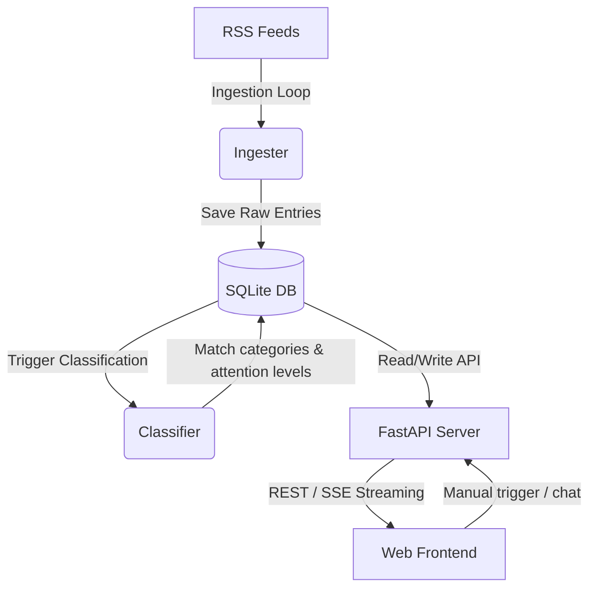

# KickRSS System Design Document

This document outlines the architecture, database schema, backend module implementations, frontend layout, and key design iterations of the **KickRSS** system (previously referred to as myRSS).

---

## 1. Product Positioning
KickRSS is an RSS reader specifically tailored for **information completionists**. Users of this platform typically subscribe to a curated set of feeds, wish to go through all new articles daily without missing a single post, and actively oppose algorithmic filter bubbles.

The design principles are:
* **No Algorithmic Filtering**: AI is only used to summarize content and allocate initial attention levels, never to decide whether an article is shown to the user. Every article remains fully visible.
* **Inbox Zero Mindset**: The entire workflow is optimized for clearing the inbox with minimum cognitive friction.
* **Per-Feed Categorization**: Categories (or "drawers") are kept local to each feed, reflecting that different feeds have different content structures.

---

## 2. System Architecture
The system follows a classic client-server model:
* **Backend**: Powered by Python 3.11+ using the [FastAPI](file:///home/bemoon/myRSS/main.py) framework and served by Uvicorn.
* **Database**: SQLite in WAL (Write-Ahead Logging) mode, managed via Python's standard `sqlite3` driver.
* **Frontend**: Single Page Application (SPA) built using vanilla HTML5, CSS3, and JavaScript, served statically by FastAPI.



---

## 3. Database Schema
The database is initialized via [db.py](file:///home/bemoon/myRSS/db.py) and operates with the following schema:

* **`feeds`**: Stores subscribed RSS sources.
* **`categories`**: Defines categories local to each feed. Includes a default `未归类` category.
* **`entries`**: Individual feed articles with publication dates, attention levels, and read statuses.
* **`fulltext`**: Cached full-text articles parsed from feed or scraped page, marked with status and source fetcher.
* **`summaries`**: AI-generated summaries cached for each article, including clickbait alerts, model metadata, and generation times.
* **`chat_messages`**: Conversations between users and the AI assistant under specific articles.

### Tables Definition
```sql
CREATE TABLE feeds (
    id              INTEGER PRIMARY KEY,
    title           TEXT NOT NULL,
    url             TEXT NOT NULL UNIQUE,
    site_url        TEXT,
    etag            TEXT,
    last_modified   TEXT,
    last_fetched_at TEXT,
    seeded          INTEGER NOT NULL DEFAULT 0,
    enabled         INTEGER NOT NULL DEFAULT 1
);

CREATE TABLE categories (
    id          INTEGER PRIMARY KEY,
    feed_id     INTEGER NOT NULL REFERENCES feeds(id),
    name        TEXT NOT NULL,
    is_default  INTEGER NOT NULL DEFAULT 0,
    created_at  TEXT,
    UNIQUE(feed_id, name)
);

CREATE TABLE entries (
    id            INTEGER PRIMARY KEY,
    feed_id       INTEGER NOT NULL REFERENCES feeds(id),
    category_id   INTEGER REFERENCES categories(id),
    guid          TEXT NOT NULL,
    title         TEXT NOT NULL,
    url           TEXT,
    author        TEXT,
    published_at  TEXT,
    fetched_at    TEXT,
    raw_content   TEXT,
    attention     TEXT,
    likely_no_text INTEGER DEFAULT 0,
    fulltext_ready INTEGER NOT NULL DEFAULT 0,
    is_read       INTEGER NOT NULL DEFAULT 0,
    read_at       TEXT,
    classified_at TEXT,
    UNIQUE(feed_id, guid)
);

CREATE TABLE fulltext (
    entry_id   INTEGER PRIMARY KEY REFERENCES entries(id),
    content    TEXT,
    status     TEXT,
    fetched_at TEXT,
    fetcher    TEXT
);

CREATE TABLE summaries (
    entry_id   INTEGER PRIMARY KEY REFERENCES entries(id),
    content    TEXT NOT NULL,
    clickbait_note TEXT,
    model      TEXT,
    created_at TEXT
);

CREATE TABLE chat_messages (
    id         INTEGER PRIMARY KEY,
    entry_id   INTEGER NOT NULL REFERENCES entries(id),
    role       TEXT NOT NULL,
    content    TEXT NOT NULL,
    created_at TEXT
);
```

---

## 4. Backend Implementation details

### 4.1 FastAPI Application ([main.py](file:///home/bemoon/myRSS/main.py))
Handles routing, CORS configuration, system settings, and server-sent event (SSE) endpoints.
* **Article Summary API** (`/entries/{entry_id}/summary`): Check database cache first. If empty, calculate clean text length, decide dynamic summary length, and call the streaming generator. Streams back AI responses chunk-by-chunk using a `StreamingResponse` for typewriter effects.
* **Translation API** (`/entries/{entry_id}/translate` or `/translate_paragraph`): Implements dynamic fulltext translation or paragraph-by-paragraph translation.
* **Interactive Chat API** (`/entries/{entry_id}/chat`): Streams user questions and AI answers, storing conversations in the `chat_messages` table.

### 4.2 AI Prompt & Inference ([ai.py](file:///home/bemoon/myRSS/ai.py))
Wraps OpenAI-compatible APIs and handles text formatting, token scaling, and prompt design:
* **Clean Text Length Estimator**: Implements `estimate_clean_text_length` to strip Markdown images, links, and HTML tags to calculate the actual readable Chinese character count.
* **Dynamic Proportional Summaries**:
  * Rules: If length $\ge 1000$ characters, target summary length is $10\%$ of clean text size, bounded between a minimum of 100 and a maximum of 900 Chinese characters.
  * Prompt Scaling: Enforces explicit boundary rules (`必须严格控制在 0.9 * target 到 1.15 * target 之间`) and structure-based instructions (requires multi-paragraph layouts for longer summaries to prevent model from stopping early).
  * Bullet-Point Preference: Formats summaries as detailed list items (`- **Point Name**: Explanation`) with optional brief introduction to maximize readability.
* **Translation and Chat Models**: Configures context history and system messages to handle inline commands.

### 4.3 RSS Ingestion Engine ([ingester.py](file:///home/bemoon/myRSS/ingester.py))
Fetches new feeds using `feedparser`.
* Conditional requests using `ETag` and `Last-Modified` headers to avoid redundant downloads.
* Normalizes feed datetime formats into timezone-aware UTC ISO strings.

### 4.4 Feed Classification & Pregeneration ([classifier.py](file:///home/bemoon/myRSS/classifier.py))
* **Cold Start Category Seeding**: Uses AI to scan up to 100 history titles when a feed is first added to draft a list of custom categories.
* **Daily Ingestion Classification**: Inspects new feed titles and matches them into existing categories. Also labels attention levels (`read`, `skim`, `glance`).
* **Pregeneration Cache**: If `pregenerate` config is active, automatically requests and caches summaries for entries marked with high-attention (`read`).

### 4.5 System Schedulers & Maintenance ([scheduler.py](file:///home/bemoon/myRSS/scheduler.py) & [maintenance.py](file:///home/bemoon/myRSS/maintenance.py))
* Runs interval fetches (every 15 mins by default).
* Executes daily cleanup and category promotion jobs (moving common topics from `未归类` into newly created formal categories).

---

## 5. Frontend UI Design ([static/app.js](file:///home/bemoon/myRSS/static/app.js) & [static/style.css](file:///home/bemoon/myRSS/static/style.css))

The UI implements a premium glassmorphic dark-theme design language (with a warm warm-grey Light Theme).

```
+--------------------------------------------------------------+
|                     Header (Title & Actions)                 |
+------------------+-------------------+-----------------------+
|                  |                   |                       |
|   Feeds Column   |  Entries Column   |    Details Column     |
|   (Subscriptions |  (List of         |    - AI Summary Box   |
|   & Categories)  |   Articles &      |    - Full-text Body   |
|                  |   Pagination)     |    - Chat Section     |
|                  |                   |                       |
+------------------+-------------------+-----------------------+
```

* **Three-Column Desktop Layout**: Sidebar Feed Tree, Middle Entries List (with Infinite Scroll pagination), and Right Reading Panel.
* **Theme Switching**: Toggle between Dark, Light, and System Auto mode. The Auto mode icon is represented by a half-filled circle.
* **Custom Markdown Rendering**: Paragraphed texts, list points (styled with customized indigo star icon `✦`), ordered lists, and key sentences highlighted in bold (`**text**`) are dynamically parsed.
* **Settings Modal**: Encompasses subscription editing, OPML import/export, and System Settings. Font sizes have been adjusted (13px - 18px) to offer comfortable reading.

---

## 6. Key Debugging History & Code Iterations

During development, several critical iterations were made to resolve design issues:

1. **Abnormal AI Summary Lengths**:
   * *Problem*: AI generated summaries were too short (200-300 characters even for 10,000-word articles).
   * *Solution*: Implemented clean char counter `estimate_clean_text_length` to ignore images, HTML, and Markdown overhead. Enforced strict Chinese character limits in prompt text and dynamically increased `max_tokens` (target * 2) to prevent truncating. Added structure-based guides (like requiring multi-paragraphs for $>600$ words target) so the model details its points instead of stopping early.
2. **Incorrect Article Timestamps**:
   * *Problem*: All new articles showed as "8 hours ago" on local timezone (UTC+8).
   * *Solution*: Normalized datetime outputs in [ingester.py](file:///home/bemoon/myRSS/ingester.py) to always return timezone-aware UTC ISO strings. Created a client-side parser `parseEntryDate` in JS that detects timezone-naive strings and appends `'Z'` to handle them as UTC, fixing both new and existing entries.
3. **JS ReferenceError on Detail Load**:
   * *Problem*: Detail loading failed with "Failed to fetch fulltext" message.
   * *Solution*: Fixed a typo in `static/app.js` line 1694 where `charCount` (which was undefined) was evaluated instead of `cleanCharCount`.
4. **Summary Format Optimization**:
   * *Problem*: Summaries were inconsistently paragraph-heavy, occasionally bullet-heavy.
   * *Solution*: Updated formatting guidelines in [ai.py](file:///home/bemoon/myRSS/ai.py) to strictly request无序列表 (`- `) as the core summary structure from the first run.
5. **Light Theme Visual Fixes**:
   * *Problem*: Light theme toggles were all colored indigo (enabling check toggle was green in dark mode but indigo in light mode). Logo text blended into the sidebar. Article body looked greyish on mobile.
   * *Solution*:
     * Separated light theme toggle slider styles in `static/style.css` so that active feed toggles are green (`#10b981`) and classify toggles are indigo (`#6366f1`).
     * Changed the light theme logo gradient to start with dark slate (`var(--text-primary)`) instead of white (`#fff`).
     * Overrode mobile `.article-scroll-view` transparent overlay in light theme with solid white (`#ffffff !important`) to eliminate grey backgrounds.
6. **SSE Stream Race Condition on Fast Navigation**:
   * *Problem*: When switching articles quickly, an ongoing AI summary generation stream (SSE) would leak into the summary box of the next opened article.
   * *Solution*: Added synchronous termination of any active SSE stream (`window.summaryEventSource.close()`) and cleanups of streaming states immediately at the beginning of `loadArticleDetails` in [static/app.js](file:///home/bemoon/myRSS/static/app.js) before fetching the new article content.

---

## 7. Progressive Web App (PWA) & Mobile Interaction Upgrade

To deliver a premium, native-app-like experience on mobile devices, the system was upgraded to a Progressive Web App (PWA) with comprehensive mobile touch gestures and screen layout safety adaptations.

### 7.1 PWA Installation & Offline Support
* **App Manifest** ([static/manifest.json](file:///home/bemoon/myRSS/static/manifest.json)): Declares standalone windowing display mode, predefined primary theme colors (`#6366f1` and `#0a0b10`), and references generated high-resolution assets.
* **Icon Assets**: Generated premium rounded-corner gradient background PNG icons ([static/icon-192.png](file:///home/bemoon/myRSS/static/icon-192.png) and [static/icon-512.png](file:///home/bemoon/myRSS/static/icon-512.png)) featuring the KickRSS lightning bolt.
* **Service Worker** ([static/sw.js](file:///home/bemoon/myRSS/static/sw.js)): Operates with an optimized caching model:
  * *Stale-While-Revalidate*: Instantly serves cached static assets (HTML, CSS, JS) for fast startups while silently retrieving and updating resources in the background.
  * *Network-First*: Ensures real-time data ingestion for feed, entry, category, and search API endpoints, falling back to cached states only when completely offline.
* **PWA Metadata & Registration**: Embedded Apple-specific viewport configuration and PWA registration logic in the main files ([static/index.html](file:///home/bemoon/myRSS/static/index.html) & [static/app.js](file:///home/bemoon/myRSS/static/app.js)).

### 7.2 Custom Mobile Gesture Controls
Implemented a responsive, viewport-aware touch handler in [static/app.js](file:///home/bemoon/myRSS/static/app.js) via custom event listeners:
1. **Three-Column Navigation Swiping**:
   * Horizontal swipe events transition classes (`show-entries` and `show-detail`) to slide panel layers in and out.
   * Leverages browser native hardware acceleration via CSS `translate3d` transforms.
   * Safety guardrails ignore events within 20px of the screen boundary to prevent interference with OS-level back/forward gestures.
   * Confirms vertical-scroll priority (detects when vertical delta exceeds horizontal delta and locks standard scrolling to avoid unintended panel changes).
2. **Left-Swipe to Mark Read**:
   * Users swipe individual unread list cards leftward to reveal a green action overlay behind the card.
   * Leverages structural cards packaging by dividing each card into a background action panel (`.entry-card-bg-action`) and foreground content container (`.entry-card-content`).
   * Elastic sliding physics apply dampened resistance for movements beyond the action threshold (70px).
   * Swiping past the threshold triggers smooth sliding transition out of viewport, calling the read API, and collapsing height to animate card deletion (in "Unread Only" mode).
   * Implements a touch movement state flag (`window.preventClickFlag`) to block the trailing click event on release, ensuring swipe release does not accidentally open the article.
3. **Pull-to-Refresh (双栏独立刷新系统)**:
   * 支持同时在“左侧订阅树列表栏”（Feeds Column）及“中间文章列表栏”（Entries Column）执行下拉刷新。当滚轮滚动至最顶端时（检测 `scrollTop <= 0` 以完美包容 iOS 的阻尼弹性负值），向下拖动会对应拉伸并展示 PTR 自定义刷新组件，提供动态提示语（如“下拉刷新全部订阅...”/“下拉刷新当前列表...”）与旋转指示器。
   * 下拉释放达 50px 阀值时，将直接调用 **`simpleRefresh()` 轻量刷新方法**，并行加载本地订阅源列表（`loadFeeds()`）与当前列表视图（`refreshCurrentListView()`）的最新数据。这样无需耗时爬取外部服务器，确保操作即时响应，而真正的全量同步操作可留给后台15分钟定时刷新或点击界面右上角的“刷新全部订阅”按钮触发。

### 7.3 Safety Area Adapters
Configured `viewport-fit=cover` in [static/index.html](file:///home/bemoon/myRSS/static/index.html) and added layout CSS overrides in [static/style.css](file:///home/bemoon/myRSS/static/style.css):
* Integrates CSS `env(safe-area-inset-top)` and `env(safe-area-inset-bottom)` values.
* Resolves status bar overlays (notched screens / pill bars) on PWA standalone startup by shifting mobile column headers downward.
* Adapts bottom buttons, top-to-bottom lists scroll padding, floating chat drawers, and bottom input text areas to offset system home indicator lines on iOS and Android.

### 7.4 Non-scrolling Action Bar & Stereoscopic Embellishment
To elevate reading immersion and fix overlapping components:
* **Float Overlaps & Compact AI Button on Mobile**:
  * *Circular Shape & Text Hidden*: To minimize visual clutter and avoid blocking core content, the mobile AI Assistant button (`#toggle-chat-drawer-btn`) in screens $\le 900$px is shrunken to a $44\times 44\text{px}$ circle (exactly matching the dimension of the "Back to Top" button). Text label is hidden via CSS, and the AI chatbot icon is centered inside.
  * *Vertical Float Stack*: Pinned on a fixed stack on the right edge (`right: 18px`):
    * AI Assistant button sits directly above the shrunken action bar at `bottom: calc(50px + env(safe-area-inset-bottom))`.
    * Back-to-Top button stacks directly above the AI button at `bottom: calc(104px + env(safe-area-inset-bottom))` with a tight 10px vertical gap.
  * *Visibility Bug Fixed*: Automatically closes active chat drawer states on back navigation to prevent the AI button from remaining hidden (`opacity: 0`) when re-entering detail panels.
* **Non-scrolling Responsive Action Bar** ([static/index.html](file:///home/bemoon/myRSS/static/index.html)): Relocated article actions (attention badges, star, mark read, original link) out of the scrolling article header into a fixed, glossy border layout (`.article-actions-bar`) and converted actions to premium SVG icons:
  * *Desktop View*: Actions are centered and aligned exactly with the width of the article body (max-width `700px` via `.article-actions-inner`) directly above it. Capped button items to a rigid equal width (`82px`) and restricted language translations to strictly 2-character limits (e.g., "原文", "已读", "收藏") for balanced and symmetrical grids. **SVG icons are scaled down to 12px** for a ultra-refined aesthetic.
  * *Mobile View*: Actions are pinned at the bottom bar (`bottom: 0`) using a layout structure that scales and hides button text labels for thumbs-friendly click zones. The mobile bottom action bar height is shrunken to a ultra-compact `38px` (with reduced padding & 9px labels) and article scroll padding is shrunken to `44px` to minimize bottom blank space.
* **System-wide Light Theme 立体感 (Stereoscopic Embossed Layout)**:
  * Softened boundaries with ultra-fine border lines (`rgba(0, 0, 0, 0.05)`).
  * Extended the sunken containers styling to all three columns (Feeds, Entries, Detail), adding deep inset shadows (`box-shadow: inset 0 4px 18px rgba(15, 23, 42, 0.05)`) and soft grey backgrounds (`#f8fafc`) to scroll panes.
  * Raised all fixed headers and footers to stand out above sunken scroll panels with explicit drop shadows and white backgrounds.
  * *Slider Toggle Visibility*: Set a soft slate grey background (`#cbd5e1`) for unchecked filter toggles under Light Theme to ensure high contrast and clear visibility.
  * *Unified Icon Color*: Stripped special green status colors from the mark-unread button, ensuring all actions on the action bar share a clean, unified hover/active visual style.
* **SVG Translation Protection**: Restructured translation callbacks in `app.js` to select inner text holders (`.btn-text`) rather than modifying button elements directly, preventing local language updates from stripping custom SVG icon nodes.
* **Unified Ellipse Undo Toast**: Redesigned the marks-as-read Undo progress toast (`.undo-toast` & `.undo-toast-btn`) as a unified sleek capsule ellipse (`border-radius: 50px`), with flat color palettes and `white-space: nowrap` constraint to strictly block dynamic text wrapping.


